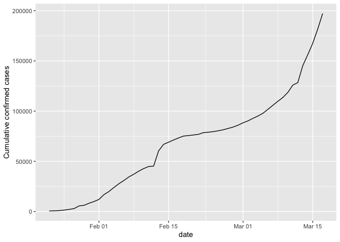
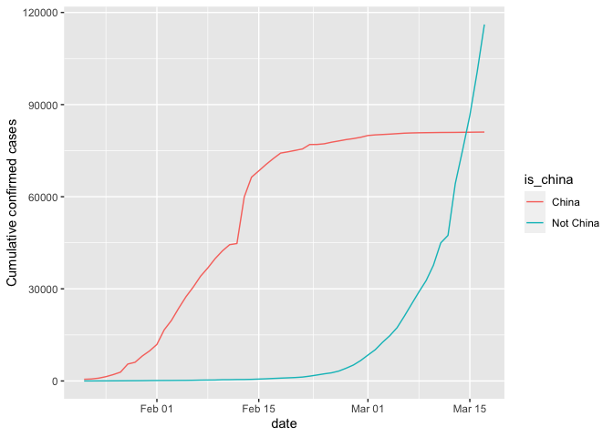
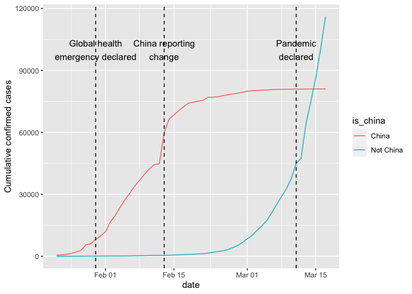
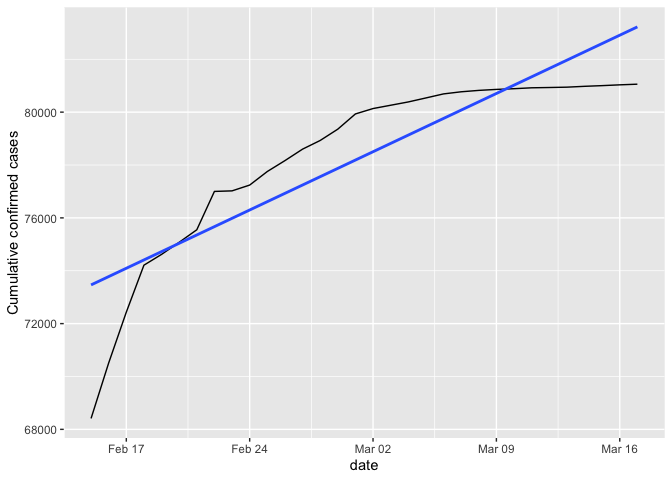
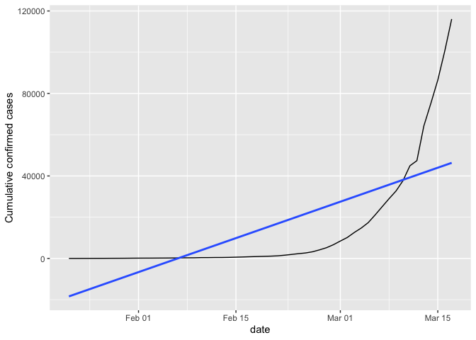
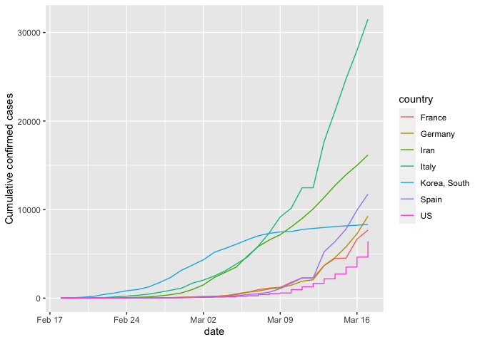

# From epidemic to pandemic, visualizing the Covid-19 pandemic. Based and inspired by DataCamp projects.

This project is an attempt (a very amateur-ish one) to try visualize the cases using R.

The data is collected from a Open repository(https://github.com/RamiKrispin/coronavirus) that consolidated data from organisations such as WHO, CDC etc. 

This project is based and inspired by the "Visualizing COVID-19" project on DataCamp.

## We will try to visualize the covid-19 pandemic during the beginning of the outbreak in 2020

### How did the confirmed cases look around the world?

We can see from the lineplot that the growth of confirmed cases was very
extreme at the beginning of the 2020 outbreak, reaching a number of
roughly 200 000 confirmed cases in just 2 months. It is also noticable
that something happened during mid February that caused a weird jump.

Let now compare the world to China, the starting point of the pandemic.

We see that in China, cases jumped dramstically in mid-february, only
for the line to flatten out, while rest of the is experiencing a
exponential growth of cumulatitive cases.

Lets annotate and add WHO-events to get a more clear view of the there
was a change as well why Chinas line began to flatten out.

It looks like that the WHO declared a global health emergency as cases
started increase heavily in early 2020 in China. We also see that Chinas
case line in the plot jumped in mid-February due to country’s changed
policy in how cases were reported and contributed to the sudden jump.

We can also see around mid-march where a global pandemic was declared as
rest of the world was in the middle of a exponential growth of
covid-cases.

lets add trend lines to get a deeper view on how the growth itself
looked like.

We can that growth rate in China slowed down after country changed the
way it was reporting cases as the growth line was growing slower than
the linear trend line.

The same could not be said about the rest of the world as the cases
started to grow exponentially and outgrew the linear trendline.

### Who got hit hardest (other than china)

Lets investigate which countries got hit the hardest outside of China

  
    ##   country      total_cases
                 
    ## 1 France              7699
    ## 2 Germany             9257
    ## 3 Iran               16169
    ## 4 Italy              31506
    ## 5 Korea, South        8320
    ## 6 Spain              11748
    ## 7 US                  6421

Lets try to visualize the data

We can see that Italy got hit the hardest outside of China in the
beginning of the Covid-19 outbreak, for those that followed the news,
this visualization might be no suprise, as Italy was the first country
that reported rapid growth of Covid-19 cases in Europe.
